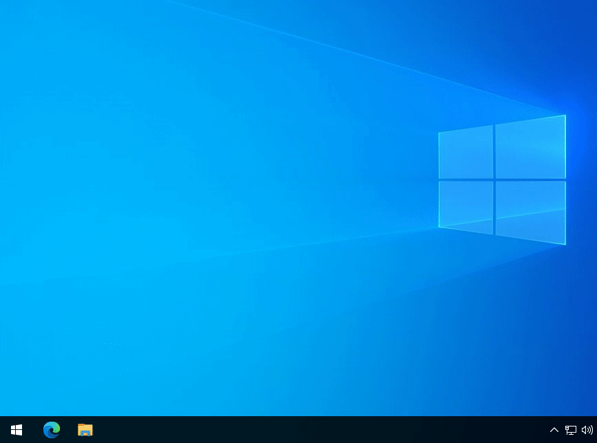

# BitLocker tools

The power of full disk encryption lies in that it is easy to understand and reason about. Unfortunately this cannot be said about the Windows 10 (professional only) solution, unless you do what I did, as explained in this post:

See: https://tqdev.com/2021-why-i-use-bitlocker-without-tpm

## create_usb.sh

This bash script ERASES everything on a USB drive and:

- Creates a GUID partition table (GPT).
- Adds a single EFI Startup Partition (ESP) on it.
- Formats the ESP in FAT16 format.
- Copies the ".BEK" files from the "keys" folder (and subfolders) to the drive.

Demo:

## Configure Bitlocker without TPM

To configure Bitlocker without TPM, follow these steps:

source: https://www.howtogeek.com/howto/6229/how-to-use-bitlocker-on-drives-without-tpm/

  - Open the Local Group Policy Editor by pressing Windows+R.
  - Type "gpedit.msc" into the Run dialog box, and press Enter.
  - Navigate to Local Computer Policy > Computer Configuration > Administrative Templates > Windows Components > BitLocker Drive Encryption > Operating System Drives in the left pane.
  - Double-click the "Require additional authentication at startup" option in the right pane.
  - Select "Enabled" at the top of the window, and ensure the "Allow BitLocker without a compatible TPM (requires a password or a startup key on a USB flash drive)" checkbox is enabled here.
  - Click "OK" to save your changes.
  - You can now close the Group Policy Editor window.

Demo:

